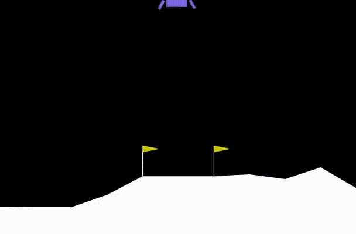
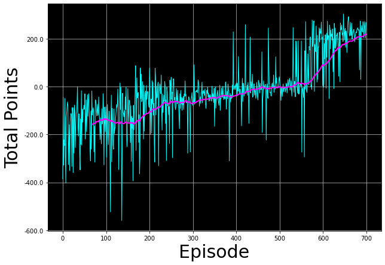

# Deep Q-Learning Agent for Lunar Lander



This repository contains the implementation of a Deep Q-Learning (DQN) agent designed to solve the Lunar Lander environment from OpenAI Gym. The agent is trained to navigate and land a lunar module safely on a designated landing pad on the moon's surface.

This project is an implementation of the "Deep Q-Learning" assignment from the **DeepLearning.AI Machine Learning Specialization** on Coursera.

## Table of Contents
- [Project Overview](#project-overview)
- [The Lunar Lander Environment](#the-lunar-lander-environment)
  - [Action Space](#action-space)
  - [State Space](#state-space)
  - [Reward System](#reward-system)
- [Core Concepts Implemented](#core-concepts-implemented)
  - [Deep Q-Networks (DQN)](#deep-q-networks-dqn)
  - [Experience Replay](#experience-replay)
  - [Target Network](#target-network)
- [Model Architecture](#model-architecture)
- [Results](#results)
  - [Training Performance](#training-performance)
  - [The Trained Agent in Action](#the-trained-agent-in-action)
- [How to Run](#how-to-run)
  - [Prerequisites](#prerequisites)
  - [Installation & Execution](#installation--execution)
- [Acknowledgements](#acknowledgements)

## Project Overview

The goal of this project is to train a reinforcement learning agent to master the `LunarLander-v2` task. The challenge lies in the continuous state space, which makes traditional Q-learning (using a table) infeasible. This project overcomes this by using a neural network to approximate the optimal action-value function, a technique known as Deep Q-Learning.

The agent learns by interacting with the environment and storing its experiences in a memory buffer. It then samples from this buffer to learn from a decorrelated batch of experiences, leading to stable and efficient training.

## The Lunar Lander Environment

The environment is a classic control problem where the objective is to land a lander on a landing pad located at coordinates `(0,0)`.

### Action Space
The agent can perform one of four discrete actions at each time step:
- `0`: Do nothing
- `1`: Fire the right orientation engine
- `2`: Fire the main engine
- `3`: Fire the left orientation engine

### State Space
The state is represented by a vector of 8 continuous values:
1.  `x` coordinate
2.  `y` coordinate
3.  `x` velocity
4.  `y` velocity
5.  `angle`
6.  `angular velocity`
7.  `leg 1 contact` (1 if in contact, 0 otherwise)
8.  `leg 2 contact` (1 if in contact, 0 otherwise)

### Reward System
- **Landing:** +100 points for landing safely, -100 for crashing.
- **Proximity:** Reward is given for moving closer to the landing pad.
- **Speed:** Reward is given for slowing down.
- **Leg Contact:** +10 points for each leg that touches the ground.
- **Fuel Consumption:** A small negative reward is applied for firing engines to encourage fuel efficiency.
- **Solved State:** The environment is considered "solved" when the agent achieves an average score of 200 or more over 100 consecutive episodes.

## Core Concepts Implemented

This project demonstrates key techniques that stabilize and improve the performance of Deep Reinforcement Learning agents.

### Deep Q-Networks (DQN)
A neural network is used to approximate the Q-function, which maps a given state to the expected return of taking each possible action. This allows the agent to handle continuous state spaces and generalize from states it has seen to new, unseen states.

### Experience Replay
To break the strong temporal correlation between consecutive experiences, the agent's experiences (`state`, `action`, `reward`, `next_state`, `done`) are stored in a fixed-size memory buffer. During training, random mini-batches are sampled from this buffer, which stabilizes the learning process.
- **Memory Size:** `100,000` experiences

### Target Network
A second, separate "target" network is used to generate the target Q-values for the loss calculation. The weights of this target network are periodically and slowly updated with the weights of the main Q-network. This creates a more stable target, preventing oscillations and divergence during training.

## Model Architecture

Both the Q-Network and the Target Network share the same architecture, built using TensorFlow/Keras:

1.  **Input Layer:** Takes the state vector (shape: `(8,)`)
2.  **Hidden Layer 1:** `Dense` layer with 64 units and `ReLU` activation.
3.  **Hidden Layer 2:** `Dense` layer with 64 units and `ReLU` activation.
4.  **Output Layer:** `Dense` layer with 4 units (one for each action) and `linear` activation.

- **Optimizer:** Adam
- **Learning Rate:** `0.001`
- **Loss Function:** Mean Squared Error (MSE)

## Results

### Training Performance
The agent was trained for up to 700 episodes. The training progress was monitored by plotting the total points per episode and the moving average over the last 100 episodes. The agent successfully learned to solve the environment, consistently achieving an average score above 200 points.



### The Trained Agent in Action
The final trained agent demonstrates intelligent behavior, controlling its descent, orientation, and speed to achieve a soft and accurate landing on the designated pad.


## How to Run

Follow these instructions to set up the environment and run the code on your local machine.

### Prerequisites
- Python 3.7
- `pip` and `venv` for package management

### Installation & Execution

1.  **Clone the repository:**
    ```bash
    git clone https://github.com/your-username/your-repo-name.git
    cd your-repo-name
    ```

2.  **Create and activate a virtual environment:**
    ```bash
    # For Windows
    python -m venv venv
    .\venv\Scripts\activate

    # For macOS/Linux
    python3 -m venv venv
    source venv/bin/activate
    ```

3.  **Install the required packages:**
    ```bash
    pip install -r requirements.txt
    ```

4.  **Run the Jupyter Notebook:**
    ```bash
    jupyter notebook "Deep Q-Learning - Lunar Lander.ipynb"
    ```
    You can then run the cells in the notebook to train the agent from scratch or load the pre-trained model (`lunar_lander_model.h5`) to see it in action.

## Acknowledgements
This project is based on the curriculum and starter code provided by the **DeepLearning.AI Machine Learning Specialization** available on [Coursera](https://www.coursera.org/specializations/machine-learning-introduction). Special thanks to the instructors and the platform for providing an excellent learning foundation.